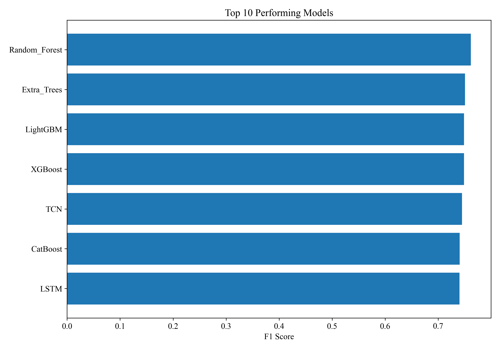
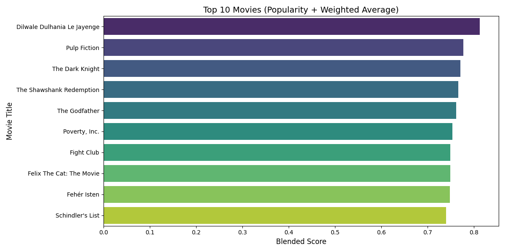
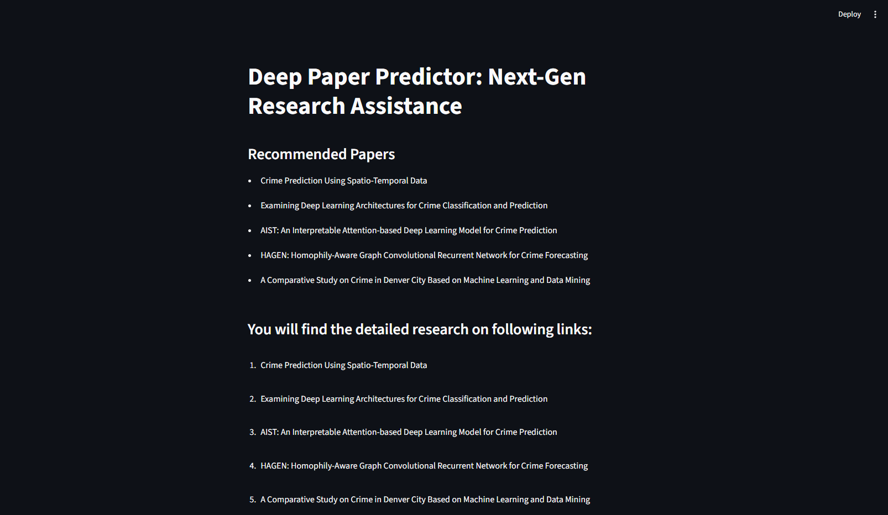
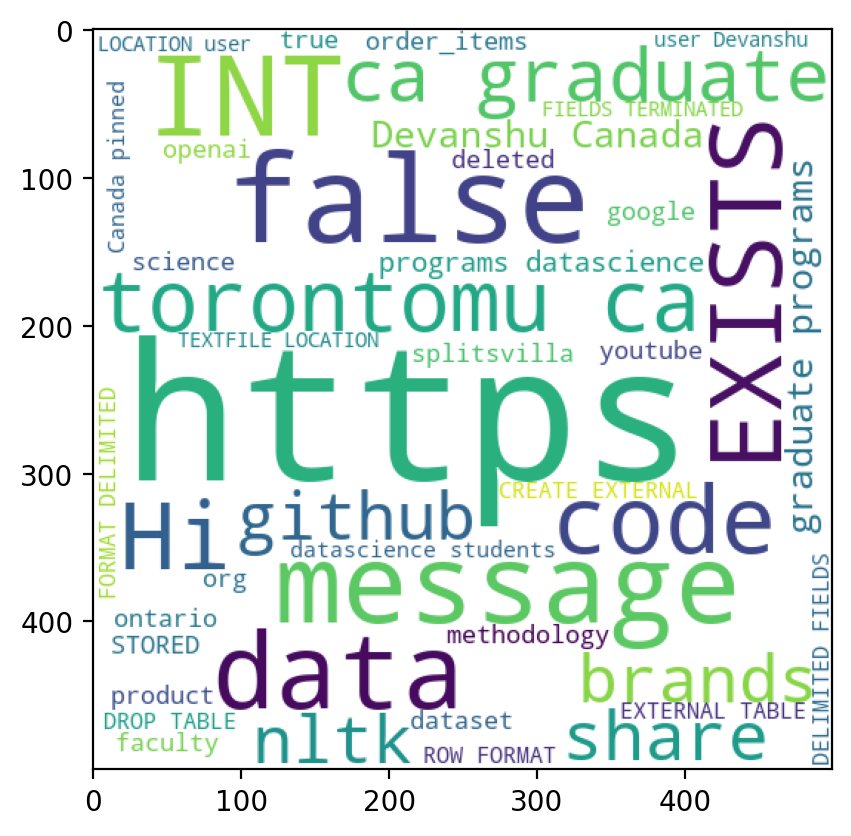
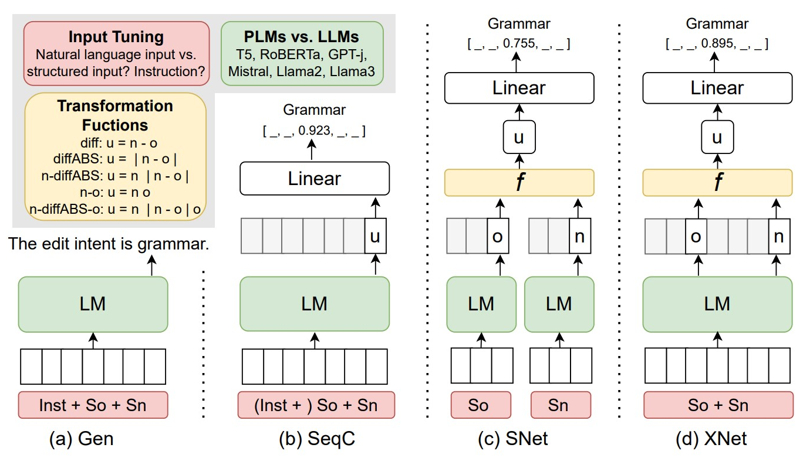
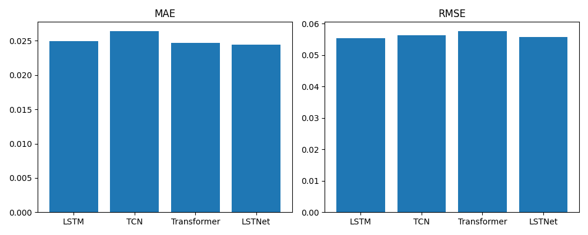

  

  
  

---

## 👋 About Me

I'm a graduate researcher and machine learning practitioner focused on building data-driven systems that solve real-world problems — from public safety analytics to recommendation engines and applied NLP. My work spans the full pipeline: data engineering, model development, evaluation, and deployment-ready applications.

I'm currently completing my **Master of Science in Data Science and Analytics** at **Toronto Metropolitan University**, where my research centers on spatio-temporal machine learning for urban crime risk modeling, supervised by **Dr. Xingwei (Nancy) Yang**.

Outside of academic research, I've worked professionally as an ML/NLP developer and frontend developer, and I enjoy turning applied ML techniques — forecasting, recommendation systems, NLP, and LLM-based tools — into complete, usable projects.

### 🎓 Education

**M.Sc. in Data Science and Analytics** — Toronto Metropolitan University *(Graduating September 2026)*
GPA: 4.28 / 4.33 &nbsp;|&nbsp; Supervisor: Dr. Xingwei (Nancy) Yang
Major Research Project: *Modeling Urban Crime Risk and Arrest Probability Using Spatio-Temporal Machine Learning Techniques*

### 💼 Experience

- **ML/NLP Developer** — TechXi
- **Frontend Developer** — TatvaSoft
- **Data Science Virtual Intern** — IBM

### 📜 Certifications

| Certificate | Issuer | Issued |
|---|---|---|
| [Python for Data Science](https://www.credly.com/badges/ad86c0e6-9c1d-4af4-be89-01ded9c13a6b) | IBM | Jul 2022 |
| [Machine Learning with Python – Level 1](https://www.credly.com/badges/117e535e-ea64-4d13-bf5e-0f01c7c0cceb) | IBM | Jul 2022 |
| [Data Visualization Using Python](https://www.credly.com/badges/7c7ad3dd-32a6-41fe-a3cf-63f48ece1aad) | IBM | Jul 2022 |
| [Data Science Foundations – Level 1](https://www.credly.com/badges/20744671-df9b-4380-a8df-b9e51a0371da) | IBM | Jul 2022 |

---

## 🚀 Projects

| # | Project |
|---|---------|
| 1 | [Modeling Urban Crime Risk & Arrest Probability](#1-modeling-urban-crime-risk-and-arrest-probability-using-spatio-temporal-machine-learning-techniques) |
| 2 | [Movies Recommendation System](#2-movies-recommendation-system) |
| 3 | [DeepPaper Predictor](#3-deeppaper-predictor) |
| 4 | [WhatsApp Chat Analyzer](#4-whatsapp-chat-analyzer) |
| 5 | [Edit Intent Classification](#5-edit-intent-classification) |
| 6 | [Energy Forecasting](#6-energy-forecasting) |
| 7 | [Saransh — Text Summarizer](#7-saransh--text-summarizer) |
| 8 | [Audio to Text Converter](#8-audio-to-text-converter) |
| 9 | [Resume Parser & PDF Generator](#9-resume-parser--pdf-generator) |

---

### 1. [Modeling Urban Crime Risk and Arrest Probability Using Spatio-Temporal Machine Learning Techniques](https://github.com/Devanshu1013/MODELING-URBAN-CRIME-RISK-AND-ARREST-PROBABILITY-USING-SPATIO-TEMPORAL-MACHINE-LEARNING-TECHNIQUES)

A full-scale research study (my Major Research Project, supervised by **Dr. Xingwei (Nancy) Yang**) that builds a spatio-temporal machine learning framework to predict the probability of arrest for a reported crime, using over two decades of real-world Chicago crime records enriched with socio-economic, weather, and public-transit mobility data — aimed at supporting data-driven public safety decisions.

**Problem & Motivation**
Not every reported crime results in an arrest, and arrest likelihood varies systematically by location, time, crime type, and the surrounding socio-economic context. This project models that variation directly, treating arrest prediction as a spatio-temporal classification problem rather than a simple crime-count forecast.

**Data**
- **Chicago crime data, 2001–2023** — the core dataset of reported incidents, crime types, locations, and arrest outcomes
- **Socio-economic indicators** by community area — income, unemployment, and related quintile-level features
- **Weather data** — temperature, rain/snow, and other daily conditions
- **Mobility / transit data** — public transit ridership trends, joined at the daily and community-area level

**Pipeline**
1. **Literature review** — grounding the approach in prior crime-prediction research
2. **Data preprocessing & integration** — merging crime, socio-economic, weather, and mobility sources into a single spatio-temporal dataset
3. **Exploratory Data Analysis (EDA)** — crime trends by year, month, day of week, and hour; domestic vs. non-domestic breakdowns; top community areas and crime types; correlation analysis between crime, socio-economic, weather, and mobility factors
4. **Feature engineering** — spatio-temporal features capturing location- and time-based patterns
5. **Experiments** — training and tuning 15 models across three sampling strategies (original, oversampled, undersampled) to handle class imbalance
6. **Results & evaluation** — comparing models on accuracy, precision, recall, F1, ROC-AUC, and PR-AUC

**Models benchmarked:** Random Forest, Extra Trees, LightGBM, XGBoost, CatBoost, Gradient Boosting, AdaBoost, Decision Tree, Logistic Regression, Linear SVM, SGD Linear SVM, MLP, LSTM, GRU, and TCN

**Key Result**
Across all sampling strategies, **Random Forest with oversampling** delivered the best overall performance, consistently topping the accuracy and F1-score rankings — ahead of boosting methods (LightGBM, XGBoost, CatBoost) and deep sequence models (LSTM, GRU, TCN).

**Status:** Written up as a formal academic research paper; currently being finalized for publication.

**Tech stack:** `Python` `Scikit-learn` `XGBoost` `LightGBM` `CatBoost` `PyTorch` `Pandas` `Spatio-Temporal Feature Engineering`

---

### 2. [Movies Recommendation System](https://github.com/Devanshu1013/Movies-Recommendation)

A DS8001 course project comparing multiple recommendation strategies — content-based, collaborative filtering, popularity-based, hybrid, and SVD — using real-world movie data from Kaggle, with a focus on evaluating each approach's strengths and trade-offs.

**Highlights:**
- Compares 5 different recommendation strategies on the same dataset
- Includes matrix factorization (SVD) alongside classic collaborative and content-based methods
- Evaluation-driven approach to compare recommendation quality across models

**Tech stack:** `Python` `Pandas` `Scikit-learn` `SVD` `Collaborative Filtering`

---

### 3. [DeepPaper Predictor](https://github.com/Devanshu1013/DeepPaper-Predictor)

A web application that helps researchers discover relevant papers and predicts the subject area of a research paper directly from its abstract, using NLP techniques such as TF-IDF and similarity ranking.

**Highlights:**
- Predicts subject area of academic papers from abstract text
- Uses TF-IDF and similarity ranking to recommend related papers
- Packaged as an interactive web application

**Tech stack:** `Python` `NLP` `TF-IDF` `Scikit-learn` `Jupyter Notebook`

---

### 4. [WhatsApp Chat Analyzer](https://github.com/Devanshu1013/WhatsApp-Chat-Analyzer)

A tool that extracts insights from exported WhatsApp chat data, giving a comprehensive overview of conversation patterns — including message frequency, media sharing trends, and sentiment analysis.

**Highlights:**
- Parses raw WhatsApp chat export files
- Visualizes message frequency, activity timelines, and media-sharing patterns
- Includes sentiment analysis on chat text

**Tech stack:** `Python` `Pandas` `Matplotlib/Seaborn` `NLP`

---

### 5. [Edit Intent Classification](https://github.com/Devanshu1013/Edit_Intent)

A transformer-based text classification system that identifies the *purpose* behind an edit made to a piece of text. Given a source sentence and its edited version, the model classifies the underlying intent behind the change.

**Highlights:**
- Transformer-based fine-tuning for intent classification
- Structured evaluation pipeline for comparing model performance
- Works on paired (original, edited) sentence data

**Tech stack:** `Python` `Transformers` `Deep Learning` `Jupyter Notebook`

---

### 6. [Energy Forecasting](https://github.com/Devanshu1013/Energy-Forecasting)

A comparative study of deep learning architectures for multivariate energy time-series forecasting. Uses 8 hours of historical sensor readings to predict the next energy consumption reading, benchmarking four different model families.

**Highlights:**
- Compares LSTM, TCN, Transformer, and LSTNet architectures on the same forecasting task
- Trained on the UCI Appliances Energy Prediction dataset (~19,700 rows, 10-minute intervals)
- Includes multi-horizon forecasting and sequence-length ablation experiments
- Chronological train/val/test split to avoid data leakage

**Tech stack:** `Python` `PyTorch` `LSTM` `TCN` `Transformer` `LSTNet`

---

### 7. [Saransh — Text Summarizer](https://github.com/Devanshu1013/Saransh)

A text summarization and translation tool that accepts both plain text and PDF input. It uses NLTK-based summarization with lemmatization for improved accuracy, and can output the summary as an audio file — including in multiple languages.

**Highlights:**
- Extracts text directly from PDF documents
- NLTK + lemmatization based extractive summarization with adjustable summary length
- Converts summaries to speech (text-to-audio) using `pyttsx3`
- Translates summaries into multiple languages, with chunked translation for long text

**Tech stack:** `Python` `NLTK` `PyMuPDF` `pyttsx3` `Translation`

<!--  -->

---

### 8. [Audio to Text Converter](https://github.com/Devanshu1013/Audio_To_Text)

A simple utility that converts audio files into text transcripts using the `speech_recognition` library.

**Highlights:**
- Converts spoken audio into text transcripts
- Lightweight, notebook-based implementation

**Tech stack:** `Python` `SpeechRecognition` `Jupyter Notebook`

<!--  -->

---

### 9. [Resume Parser & PDF Generator](https://github.com/Devanshu1013/Resume_Converter)

A tool that extracts text from an uploaded resume PDF, pulls out structured information (name, skills, experience, education, projects, hackathons, and achievements), and regenerates it as a clean, professionally formatted PDF resume — making it easier to review and compare resumes in one consistent format.

**Highlights:**
- Extracts structured fields from raw resume PDFs using `PyPDF2` and regex
- Generates a standardized, professional PDF resume with `ReportLab`
- Simple upload-and-generate interface built with Streamlit

**Tech stack:** `Python` `Streamlit` `PyPDF2` `ReportLab`

<!--  -->

---

## 🛠️ Technical Skills

**Languages:** Python, Java, C++
**Machine Learning:** Supervised & Unsupervised Learning, Classification, Regression, Feature Engineering, Model Evaluation, Cross-Validation
**Deep Learning:** TensorFlow, PyTorch, Keras, CNN, RNN, LSTM, Transformers
**NLP:** Text Preprocessing, TF-IDF, Word Embeddings, Text Classification
**Data Analysis & Visualization:** Pandas, NumPy, Matplotlib, Seaborn
**Databases & Tools:** MySQL, Git, Streamlit

---

## 📫 Contact

- LinkedIn: [linkedin.com/in/devanshu1013](https://www.linkedin.com/in/devanshu1013/)
- GitHub: [github.com/Devanshu1013](https://github.com/Devanshu1013)
