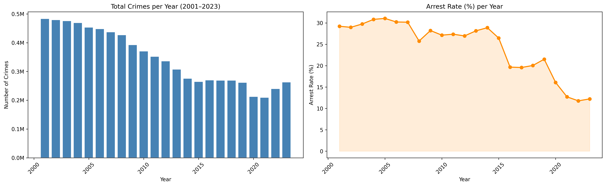
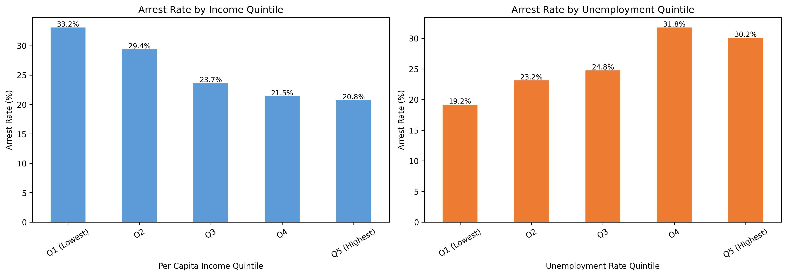
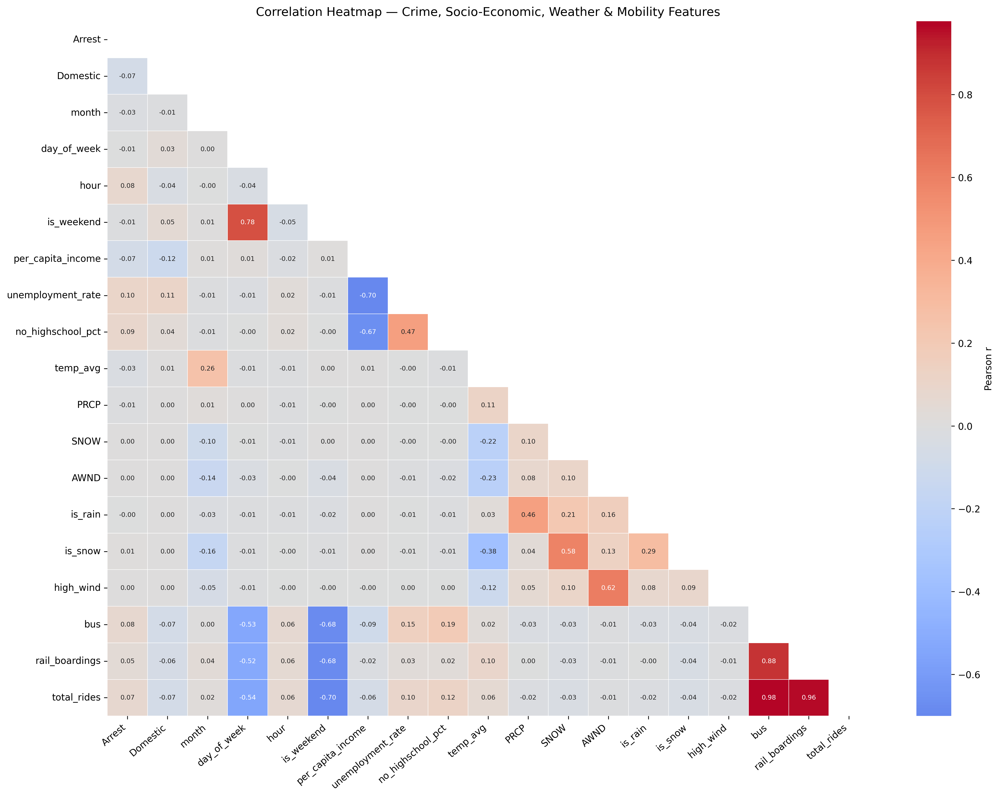
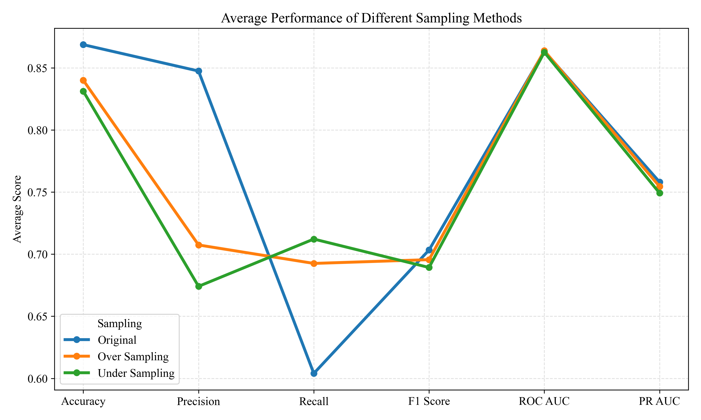
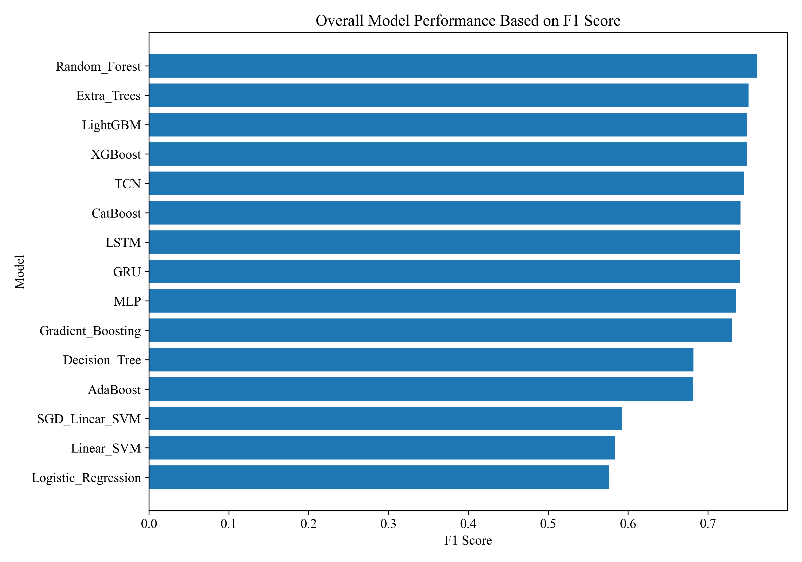
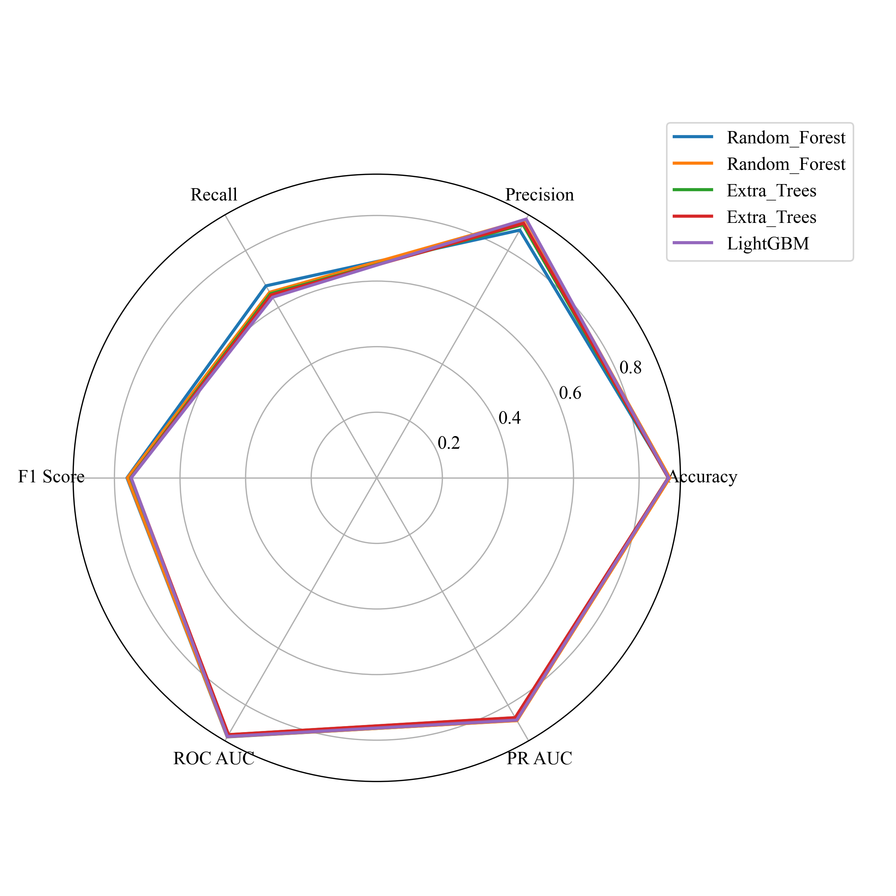

  

🔗 <a href="https://github.com/Devanshu1013/MODELING-URBAN-CRIME-RISK-AND-ARREST-PROBABILITY-USING-SPATIO-TEMPORAL-MACHINE-LEARNING-TECHNIQUES">Original Repository</a> &nbsp;|&nbsp; <a href="./README.md">← Back to Portfolio</a>

---

## Overview

This project is my Major Research Project, a full-scale academic study that builds a spatio-temporal machine learning framework to estimate the probability of arrest for a reported crime. It draws on over two decades of real-world Chicago crime records, enriched with socio-economic, weather, and public-transit mobility data, to support more data-driven public safety decisions.

## Background

Not every reported crime ends in an arrest, and that outcome isn't random — it varies systematically by location, time of day, crime type, and the socio-economic conditions of the surrounding neighborhood. Between 2001 and 2023, total reported crime in Chicago fell steadily, yet the arrest rate declined even more sharply, dropping from roughly 30% in the early 2000s to around 12% by 2023.

  

That widening gap is the motivation for this project: arrest likelihood needed to be modeled directly, as its own spatio-temporal classification problem, rather than inferred from simple crime-count forecasts.

To explain that gap, the project pulls in three additional data sources alongside the core crime records:

- **Socio-economic indicators** (income and unemployment by community area) — arrest rates ranged from 33% in the lowest income quintile down to 21% in the highest, showing that policing outcomes are tightly linked to neighborhood-level economic conditions.

  

- **Weather data** (temperature, rain, snow) — daily conditions shift both how much crime occurs and how it's resolved.
- **Mobility / transit data** (public transit ridership) — used as a proxy for foot traffic and neighborhood activity levels, which affects both crime exposure and police presence.

A correlation analysis across all four sources confirmed that these factors interact rather than acting in isolation — for example, weekend activity, transit ridership, and income are all correlated with each other and with arrest outcomes — which justified combining them into a single modeling framework instead of treating crime as a standalone time series.

  

## Methodology

1. **Literature review** — grounding the approach in prior crime-prediction research
2. **Data preprocessing & integration** — merging crime, socio-economic, weather, and mobility sources into a single spatio-temporal dataset
3. **Exploratory Data Analysis (EDA)** — crime trends by year, month, day of week, and hour; domestic vs. non-domestic breakdowns; top community areas and crime types; correlation analysis across all feature groups
4. **Feature engineering** — spatio-temporal features capturing location- and time-based patterns
5. **Experiments** — training and tuning 15 models across three sampling strategies (original, oversampled, undersampled) to handle class imbalance
6. **Evaluation** — comparing every model–sampling combination on accuracy, precision, recall, F1, ROC-AUC, and PR-AUC

**Models benchmarked:** Random Forest, Extra Trees, LightGBM, XGBoost, CatBoost, Gradient Boosting, AdaBoost, Decision Tree, Logistic Regression, Linear SVM, SGD Linear SVM, MLP, LSTM, GRU, and TCN

## Results

Oversampling gave the most balanced lift across metrics — improving precision and recall together — while the original, imbalanced data pushed accuracy artificially high at the cost of recall.

  

Across all 15 models, tree-based ensembles led the field, with **Random Forest** (paired with oversampling) delivering the best overall F1 score — ahead of Extra Trees, LightGBM, XGBoost, CatBoost, and the deep sequence models (LSTM, GRU, TCN).

  

A closer look at the top 5 models across every metric shows just how tightly they're clustered — Random Forest holds a consistent edge in precision and F1, while all five converge on similarly strong ROC-AUC and PR-AUC scores.

  

## Status

Written up as a formal academic research paper; currently being finalized for publication.

## Tech Stack

`Python` `Scikit-learn` `XGBoost` `LightGBM` `CatBoost` `PyTorch` `Pandas` `Spatio-Temporal Feature Engineering`

---

<a href="./README.md">← Back to Portfolio</a> &nbsp;|&nbsp; 🔗 <a href="https://github.com/Devanshu1013/MODELING-URBAN-CRIME-RISK-AND-ARREST-PROBABILITY-USING-SPATIO-TEMPORAL-MACHINE-LEARNING-TECHNIQUES">View on GitHub</a>

