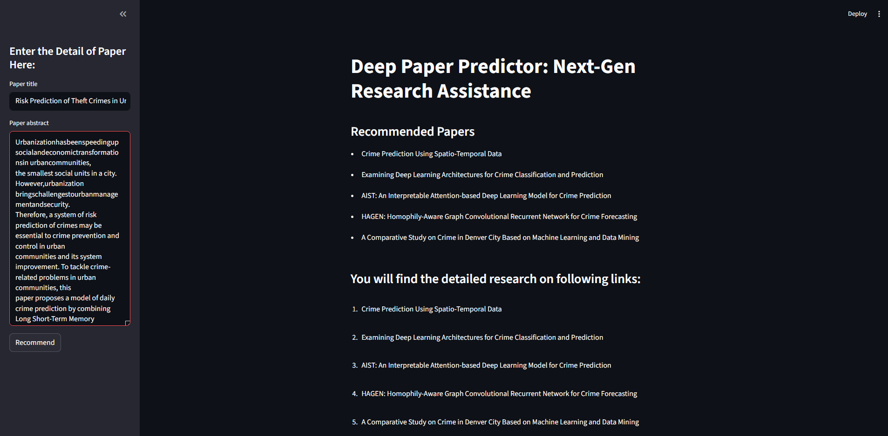

  

🔗 <a href="https://github.com/Devanshu1013/DeepPaper-Predictor">Original Repository</a> &nbsp;|&nbsp; <a href="https://devanshu1013.github.io/Devanshu_Portfolio/">← Back to Portfolio</a>

---

## Overview

DeepPaper Predictor is a web application that helps researchers discover relevant academic papers and predicts the subject area of a research paper directly from its abstract. It combines classic NLP techniques — TF-IDF vectorization and cosine similarity ranking — into a simple, interactive tool that turns a raw abstract into a ranked list of related work in seconds.

**Highlights:**
- Predicts the subject area of academic papers directly from abstract text
- Uses TF-IDF and similarity ranking to recommend related papers
- Packaged as an interactive, easy-to-use web application

## Background

Literature review is one of the most time-consuming parts of doing research. Before the real analysis or experimentation begins, a researcher typically has to manually search databases, skim dozens of abstracts, and piece together where their own work fits within the existing body of literature. This process is slow, repetitive, and easy to get wrong — related papers can be missed simply because they use different terminology, or because there are too many candidates to review by hand.

DeepPaper Predictor was built to remove that friction. Instead of requiring a researcher to manually search and cross-reference, the tool takes a paper's title and abstract as input and automatically surfaces the most closely related existing papers, along with a predicted subject area. The goal is to give a researcher a reliable starting map of their field in seconds, rather than hours of manual digging — which is especially valuable early in a project, when framing the problem and understanding prior work matters most.

## Methodology

The system is built around a straightforward but effective NLP pipeline:

1. **Input** — the user enters a paper's title and abstract into the app's text fields
2. **Text preprocessing & vectorization** — the abstract text is cleaned and transformed into a numerical representation using **TF-IDF (Term Frequency–Inverse Document Frequency)**, which weighs words by how distinctive they are to a document rather than just how often they appear
3. **Similarity ranking** — the TF-IDF vector for the input abstract is compared against a corpus of existing papers using **cosine similarity**, a measure of how closely two documents align in vector space regardless of length
4. **Subject prediction** — based on the strongest matches, the app infers the most likely subject area for the input paper
5. **Recommendation output** — the top-ranked related papers are returned to the user, each linked out to its full source for deeper reading

This keeps the approach lightweight and interpretable: rather than relying on a black-box deep learning model, TF-IDF and cosine similarity make it easy to reason about *why* a given paper was recommended, which matters for a research-facing tool.

## Results & Demo

In practice, the tool performs well on domain-specific abstracts. For example, given an abstract on urban crime prediction, the app correctly surfaces closely related work — including papers on spatio-temporal crime prediction, deep learning architectures for crime classification, attention-based crime prediction models, and graph-based crime forecasting — all ranked by similarity score, with each result linked out to its full source.

  

The side-by-side layout (paper input on the left, recommendations on the right) makes it easy to iterate — a researcher can tweak the abstract and immediately see how the recommendations shift, which is useful both for validating the tool and for refining how a paper's own abstract is framed.

## Tech Stack

`Python` `NLP` `TF-IDF` `Scikit-learn` `Jupyter Notebook`

---

<a href="https://github.com/Devanshu1013/Devanshu_Portfolio/blob/main/README.md">← Back to Portfolio</a> &nbsp;|&nbsp; 🔗 <a href="https://github.com/Devanshu1013/DeepPaper-Predictor">View on GitHub</a>

