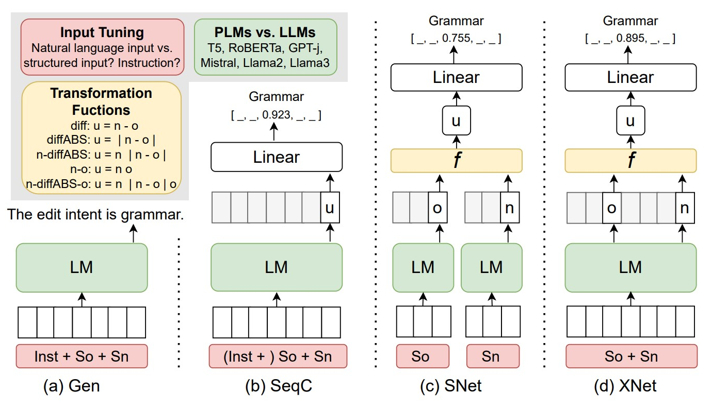

  

🔗 <a href="https://github.com/Devanshu1013/Edit_Intent">Original Repository</a> &nbsp;|&nbsp; <a href="https://github.com/Devanshu1013/Devanshu_Portfolio/blob/main/README.md">← Back to Portfolio</a>

---

## Overview

A transformer-based text classification system that identifies the *purpose* behind an edit made to a piece of text. Given a source sentence and its edited version, the model classifies the underlying intent behind the change — for example, whether the edit was made to fix grammar, clarify meaning, adjust tone, or correct a factual error.

**Highlights:**
- Transformer-based fine-tuning for intent classification
- Structured evaluation pipeline for comparing model performance
- Works on paired (original, edited) sentence data

## Background

Every time a piece of text is revised — a Wikipedia article, a student essay, a pull request description, a piece of collaborative writing — the edit carries an implicit *reason*: the editor is fixing a typo, rewording an awkward sentence, updating a fact, or changing the tone. Knowing that reason has real value: it can power smarter writing assistants that explain *why* a suggested change is being made, help researchers study how documents evolve over successive revisions, or help moderation systems distinguish constructive edits from vandalism.

The challenge is that intent isn't stated anywhere in the text itself — it has to be inferred purely by comparing the original sentence (`So`) to its edited version (`Sn`). This project treats that as a classification problem: given a pair of sentences, predict the edit's intent label (e.g. "grammar") from a fixed label set. Because there are several fundamentally different ways to feed a sentence *pair* into a language model, the project's core contribution is a systematic comparison of four distinct architectural approaches, rather than committing to just one.

## Methodology

  

All four approaches take the same raw input — an original sentence `So` and its new (edited) version `Sn` — but differ in *how* that pair is encoded and turned into a prediction. Each is explained in detail below.

### (a) Gen — Generative Classification
The original sentence, new sentence, and (optionally) an explicit instruction are concatenated into a single text sequence (`Inst + So + Sn`) and passed through a language model. Rather than attaching a separate classification head, this approach treats the task as **text generation**: the model is prompted to directly generate the label in natural language, e.g. *"The edit intent is grammar."* This is the natural fit for large generative models (LLMs) that are better suited to producing free-form text than to being fine-tuned with a custom output head.

### (b) SeqC — Sequence Classification
Like Gen, the original and new sentence are concatenated into one input sequence (optionally with an instruction prefix) and passed through a single language model. The key difference is in the output: instead of generating a label as text, the model's pooled representation (`u`) — typically the final hidden state of a special token — is passed through a **linear classification head**, which outputs a probability distribution over the fixed label set (e.g. `[_, _, 0.923, _, _]` for "grammar"). This is the standard fine-tuning setup used with pretrained encoder models like RoBERTa.

### (c) SNet — Siamese Network
Here, `So` and `Sn` are encoded **independently** — each sentence is passed through its own forward pass of the language model, producing two separate representations, `o` and `n`. These are then combined using a **transformation function** `f` into a single unified vector `u`, which is passed to the linear classifier. Because the two sentences never attend to each other during encoding, this approach isolates each sentence's representation before comparing them — similar in spirit to a Siamese network used for sentence-pair similarity tasks.

### (d) XNet — Cross-Encoded Network
XNet also produces separate `o` and `n` representations for the transformation function `f`, but unlike SNet, the two sentences are **encoded jointly** — `So + Sn` is passed through the language model together as one sequence, allowing cross-attention between the original and edited sentence during encoding. The individual token representations for the original and new spans are then extracted from this joint encoding before being combined by `f`. This lets the model directly condition its understanding of what changed on both versions simultaneously, at the cost of being architecturally more complex than SNet.

### Transformation Functions (`f`)
For the SNet and XNet approaches, five different ways of combining the `o` and `n` representations into a single vector `u` were tested:

| Function | Definition | Intuition |
|---|---|---|
| `diff` | `u = n - o` | Captures the raw direction of change |
| `diffABS` | `u = \|n - o\|` | Captures the magnitude of change, ignoring direction |
| `n-diffABS` | `u = n \| \|n - o\|` | Combines the edited sentence with how much it changed |
| `n-o` | `u = n \| o` | Simple concatenation, letting the classifier learn the relationship |
| `n-diffABS-o` | `u = n \| \|n - o\| \| o` | Full concatenation of both sentences plus their difference |

### Input Tuning
Beyond the four architectures, the project also explores how the *input* itself is framed — whether the model performs better with natural language input versus a more structured input format, and whether including an explicit instruction (e.g. *"Classify the intent of this edit"*) improves classification versus letting the model infer the task implicitly.

### PLMs vs. LLMs
The comparison spans both pretrained language models (PLMs) and large language models (LLMs), to test whether scale and generative pretraining translate into better edit-intent classification:
- **PLMs (encoder-based, fine-tuned):** RoBERTa
- **LLMs (decoder-based, generative):** T5, GPT-J, Mistral, Llama2, Llama3

## Evaluation

A structured evaluation pipeline compares all combinations — architecture (Gen / SeqC / SNet / XNet), transformation function (for SNet/XNet), input format, and base model (PLM vs. LLM) — on the same paired (original, edited) sentence dataset, to identify which configuration most reliably recovers the correct edit intent label.

## Tech Stack

`Python` `Transformers` `Deep Learning` `Jupyter Notebook`

---

<a href="https://github.com/Devanshu1013/Devanshu_Portfolio/blob/main/README.md">← Back to Portfolio</a> &nbsp;|&nbsp; 🔗 <a href="https://github.com/Devanshu1013/Edit_Intent">View on GitHub</a>

