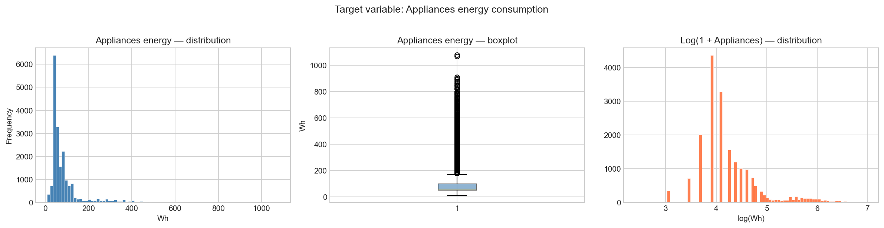
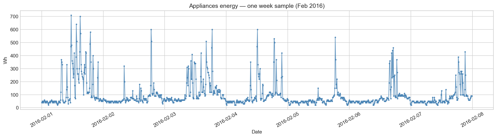
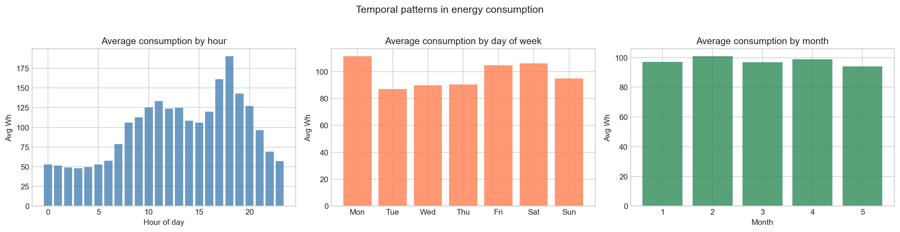
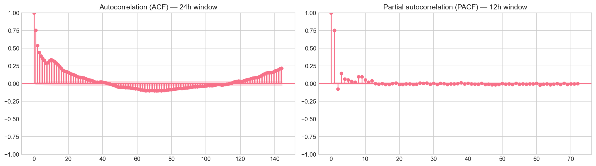
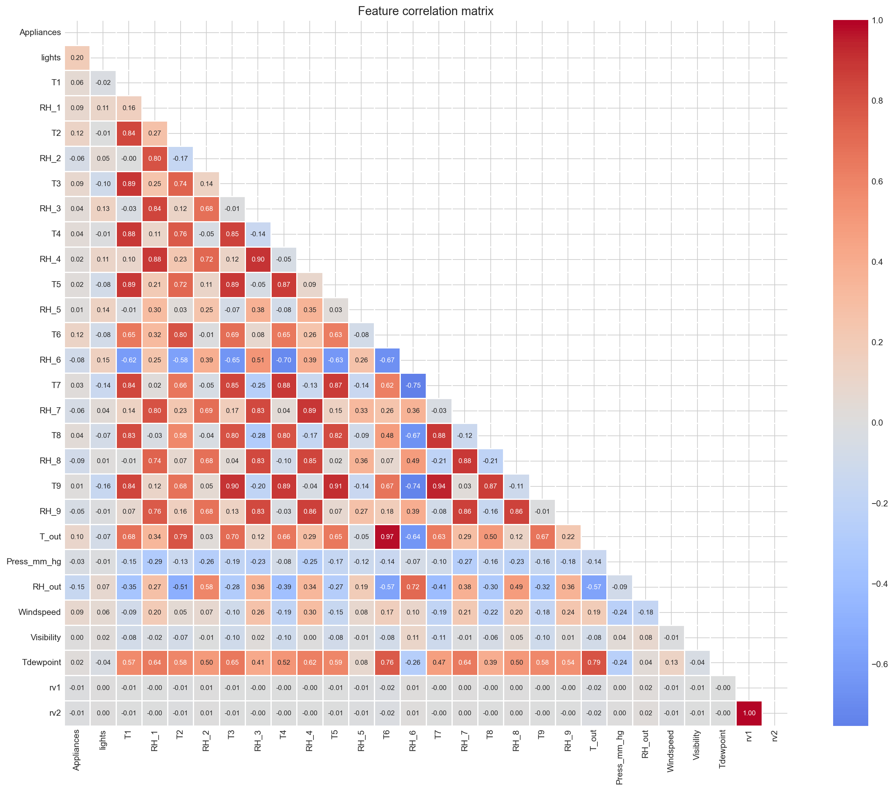
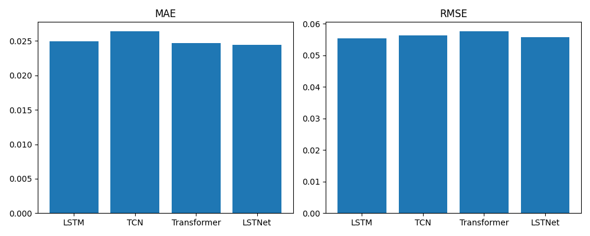

  

🔗 <a href="https://github.com/Devanshu1013/Energy-Forecasting">Original Repository</a> &nbsp;|&nbsp; <a href="https://devanshu1013.github.io/Devanshu_Portfolio/">← Back to Portfolio</a>

---

## Overview

A comparative study of deep learning architectures for multivariate energy time-series forecasting. Uses 8 hours of historical sensor readings to predict the next energy consumption reading, benchmarking four different model families.

**Highlights:**
- Compares LSTM, TCN, Transformer, and LSTNet architectures on the same forecasting task
- Trained on the UCI Appliances Energy Prediction dataset (~19,700 rows, 10-minute intervals)
- Includes multi-horizon forecasting and sequence-length ablation experiments
- Chronological train/val/test split to avoid data leakage

## Background

Forecasting household energy consumption has real practical value — utilities use it for demand-response planning, smart-home systems use it to schedule appliances around cheaper or greener power, and HVAC controllers use it to anticipate load rather than just react to it. But appliance-level energy consumption is a notoriously difficult signal to forecast: unlike something driven mostly by physical processes (like outdoor temperature), it's driven largely by human behavior — when someone turns on an oven, runs a dryer, or switches on lights — which shows up as sharp, irregular spikes rather than a smooth trend.

That's exactly what the raw data shows: appliance energy consumption spikes erratically throughout the day, with no single clean pattern, and a small number of very large spikes pull the distribution into a strongly right-skewed shape.

  

Because of that skew, the target variable was log-transformed (`log(1 + Appliances)`) before modeling, which produces a far more symmetric, model-friendly distribution — visible in the rightmost panel above.

Zooming into a single week makes the behavioral nature of the signal clear: consumption sits at a low baseline for long stretches, punctuated by sudden, short-lived spikes tied to specific appliance usage.

  

This combination — a noisy, spiky, human-driven signal — is exactly the kind of setting where the *choice of model architecture* matters: some architectures (like LSTM) are built to track long, smooth sequential dependencies, while others (like TCN and Transformer) are built to capture different kinds of temporal structure. That's the motivation for comparing four distinct architectures on the same task rather than assuming any one of them is the right fit upfront.

## Methodology

**1. Exploratory Data Analysis**
Before modeling, the data was analyzed for temporal structure. Average consumption by hour of day, day of week, and month reveals clear behavioral patterns — consumption rises sharply in the evening (peaking around 6 PM) and is somewhat higher on Fridays and Saturdays than midweek — confirming that time-of-day and day-of-week are informative signals for the model to learn from.

  

Autocorrelation (ACF) and partial autocorrelation (PACF) analysis were used to understand how far back in time useful signal persists. The ACF shows meaningful correlation decaying over the first ~40 lags before flattening, with a slight upturn near the 24-hour mark (144 steps at 10-minute resolution) hinting at a weak daily cycle; the PACF shows a sharp cutoff after the first couple of lags, indicating that most of the directly useful autoregressive signal is concentrated in the most recent readings. This analysis directly informed the choice of an 8-hour (48-step) input window as a reasonable balance between capturing recent dependency and avoiding unnecessary noise from stale history.

  

A feature correlation matrix across all sensor readings (temperature and humidity across 9 rooms, plus outdoor weather variables) was also computed, revealing strong multicollinearity among the temperature sensors (T1–T9) — expected, since temperature across rooms of the same house tends to move together — which informed feature selection and helped avoid feeding the model redundant signals.

  

**2. Data preparation**
- Target variable log-transformed to reduce skew
- Chronological (not random) train / validation / test split, to prevent future information from leaking into training — critical for any time-series task
- Sliding windows of 8 hours (48 timesteps at 10-minute resolution) constructed as model input, predicting the next reading

**3. Model architectures benchmarked**
- **LSTM** — a recurrent architecture that processes the sequence step-by-step, maintaining a hidden state that carries information forward; well-suited to capturing longer sequential dependencies
- **TCN (Temporal Convolutional Network)** — uses causal, dilated convolutions to process the whole sequence in parallel rather than recurrently, often faster to train while still capturing long effective receptive fields
- **Transformer** — uses self-attention to weigh the relevance of every timestep in the input window directly against every other timestep, without the sequential bottleneck of an RNN
- **LSTNet** — a hybrid architecture that combines convolutional layers (to extract short-term local patterns) with a recurrent component (to capture longer-term dependencies), plus a separate autoregressive component designed specifically for signals with strong local scale variation

**4. Experiments**
- **Multi-horizon forecasting** — evaluating each model not just one step ahead, but across multiple forecast horizons, to see how performance degrades further into the future
- **Sequence-length ablation** — testing different input window lengths to confirm the impact of the ACF/PACF-informed 8-hour choice on final performance

## Results

All four architectures were evaluated on Mean Absolute Error (MAE) and Root Mean Squared Error (RMSE) on the held-out test set:

  

The four architectures land in a tight performance band, with no single model dominating on both metrics: **LSTNet** achieves the lowest MAE, while **LSTM** achieves the lowest RMSE — meaning LSTNet is slightly more accurate on average, but LSTM is slightly more consistent in avoiding large errors. **TCN** trails on MAE, and **Transformer** trails on RMSE, suggesting that for this particular signal — noisy, spiky, and behavior-driven rather than smoothly periodic — the added capacity of attention-based or purely convolutional architectures doesn't translate into a clear advantage over recurrent and hybrid approaches.

## Tech Stack

`Python` `PyTorch` `LSTM` `TCN` `Transformer` `LSTNet`

---

<a href="https://github.com/Devanshu1013/Devanshu_Portfolio/blob/main/README.md">← Back to Portfolio</a> &nbsp;|&nbsp; 🔗 <a href="https://github.com/Devanshu1013/Energy-Forecasting">View on GitHub</a>

