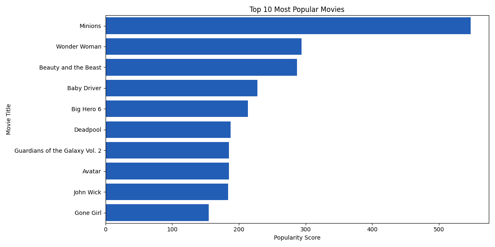
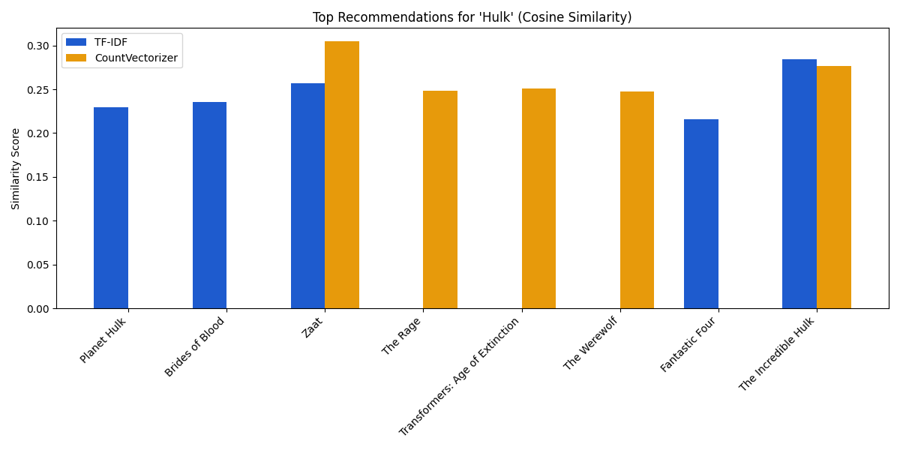
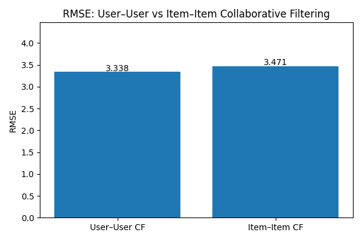
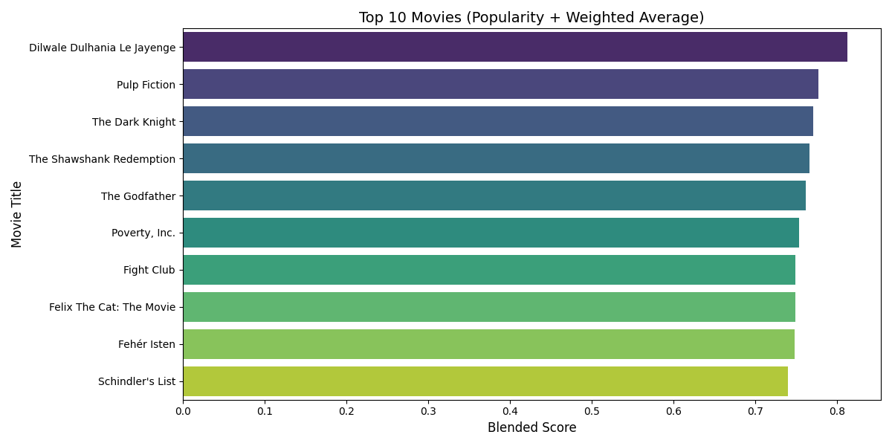
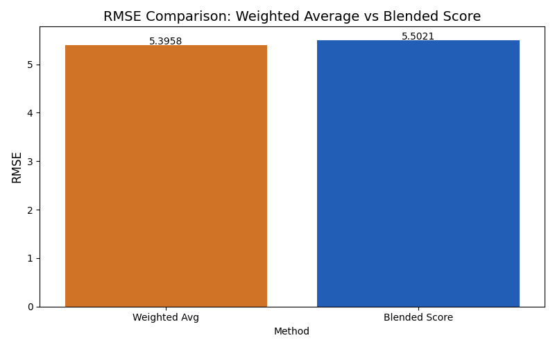

  

🔗 <a href="https://github.com/Devanshu1013/Movies-Recommendation">Original Repository</a> &nbsp;|&nbsp; <a href="https://github.com/Devanshu1013/Devanshu_Portfolio/blob/main/README.md">← Back to Portfolio</a>

---

## Overview

A DS8001 course project comparing multiple recommendation strategies — content-based, collaborative filtering, popularity-based, hybrid, and SVD — using real-world movie data from Kaggle, with a focus on evaluating each approach's strengths and trade-offs.

**Highlights:**
- Compares 5 different recommendation strategies on the same dataset
- Includes matrix factorization (SVD) alongside classic collaborative and content-based methods
- Evaluation-driven approach to compare recommendation quality across models

## Approaches & Results

**Popularity-Based** ranks movies purely by volume and audience reach, giving a simple, non-personalized baseline.

  

**Content-Based Filtering** recommends movies with similar attributes (genre, cast, keywords) using cosine similarity over TF-IDF and CountVectorizer representations. For a query like *Hulk*, both vectorizers surface genre-aligned titles such as *The Incredible Hulk* and *Fantastic Four*, with similarity scores in a comparable range.

  

**Collaborative Filtering** predicts ratings from user behavior patterns rather than movie attributes. User–user and item–item variants were both evaluated on RMSE, with user–user CF (3.34) slightly outperforming item–item CF (3.47).

  

**Hybrid Model** blends popularity with weighted average ratings to balance broad appeal against genuine audience reception — surfacing titles like *Pulp Fiction*, *The Dark Knight*, and *The Shawshank Redemption* alongside high-popularity picks.

  

A further comparison of blending strategies shows the weighted-average approach (RMSE 5.40) edging out the blended score method (RMSE 5.50) on this dataset.

  

## Tech Stack

`Python` `Pandas` `Scikit-learn` `SVD` `Collaborative Filtering`

---

<a href="https://github.com/Devanshu1013/Devanshu_Portfolio/blob/main/README.md">← Back to Portfolio</a> &nbsp;|&nbsp; 🔗 <a href="https://github.com/Devanshu1013/Movies-Recommendation">View on GitHub</a>

