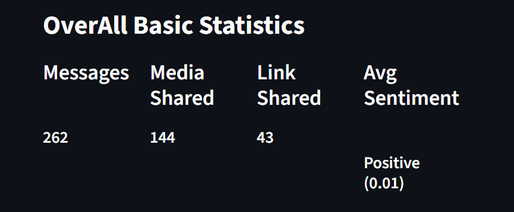
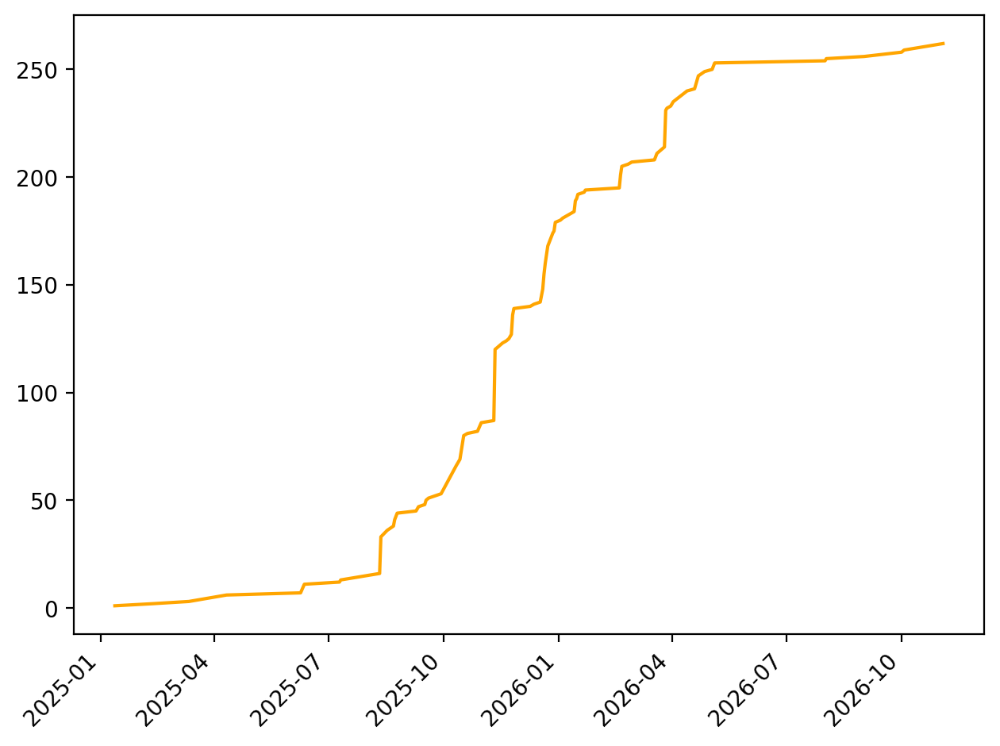
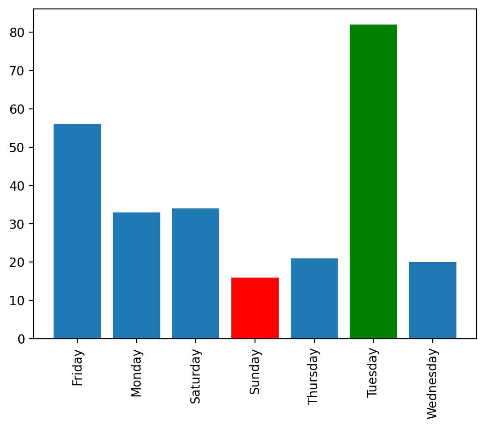
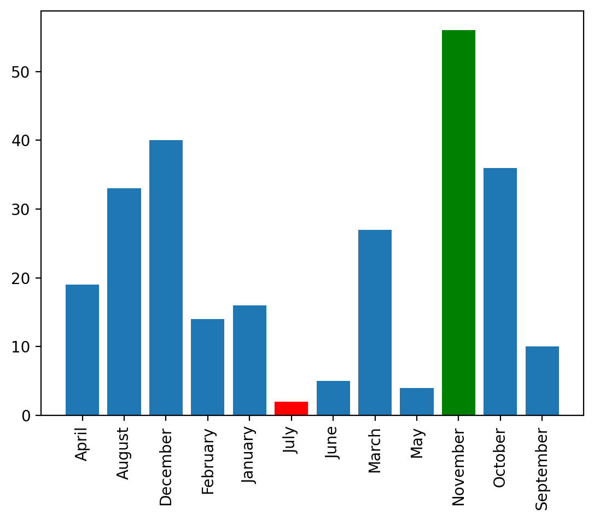
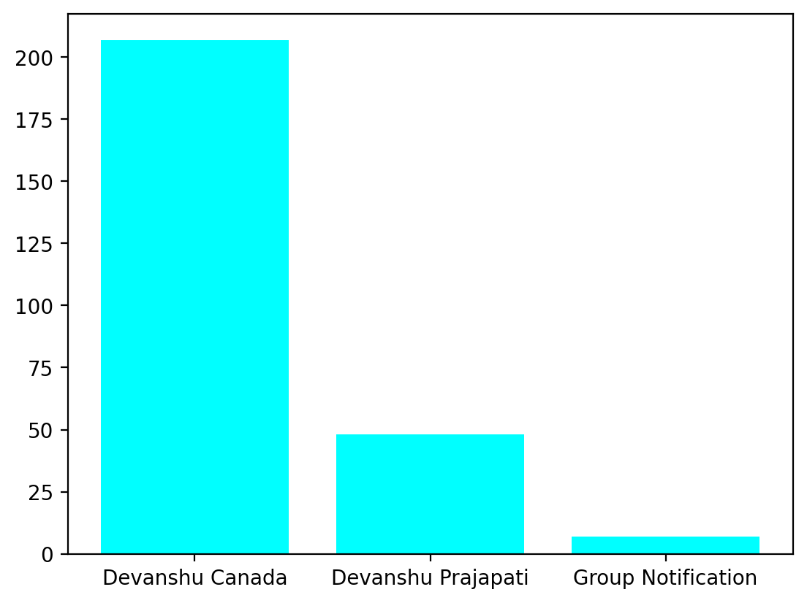
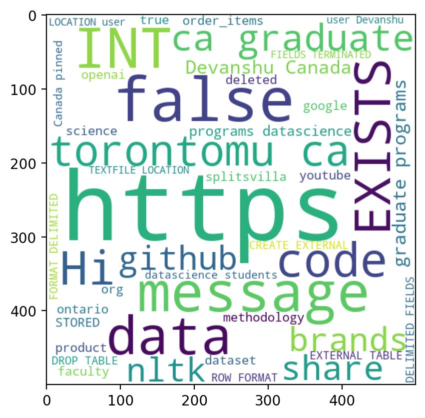
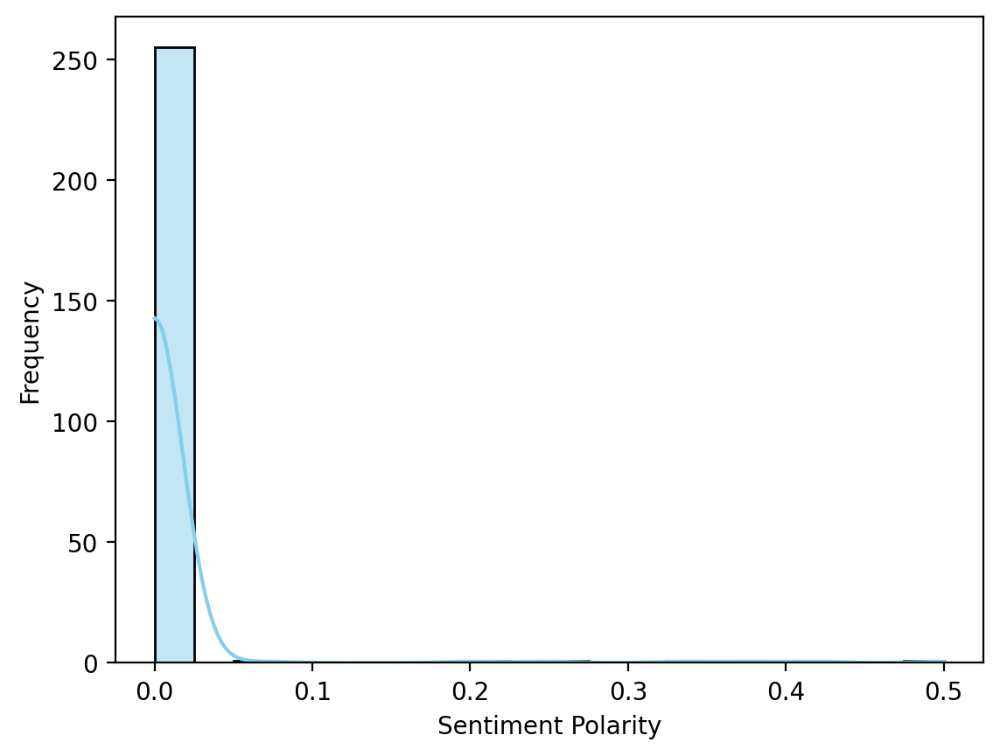

  

🔗 <a href="https://github.com/Devanshu1013/WhatsApp-Chat-Analyzer">Original Repository</a> &nbsp;|&nbsp; <a href="https://devanshu1013.github.io/Devanshu_Portfolio/">← Back to Portfolio</a>

---

## Overview

A tool that extracts insights from exported WhatsApp chat data, giving a comprehensive overview of conversation patterns — including message frequency, media sharing trends, activity timelines, and sentiment analysis.

**Highlights:**
- Parses raw WhatsApp chat export files
- Visualizes message frequency, activity timelines, and media-sharing patterns
- Includes sentiment analysis on chat text

## Background

WhatsApp is one of the most heavily used messaging platforms, yet the app itself gives users almost no visibility into their own conversation patterns — no breakdown of who talks the most, when a chat is most active, what topics come up most often, or how the tone of a conversation shifts over time. That data exists in every exported chat file, but it's locked inside a plain, unstructured `.txt` export that isn't meant to be read directly.

This project turns that raw export into something genuinely useful: a structured analytics view of a conversation. The goal was to make chat analysis accessible to anyone — no coding required — by taking a file WhatsApp already lets you export and turning it into a set of clear, interpretable statistics and visualizations, similar to how analytics dashboards work for social media or fitness apps, but applied to personal messaging data.

## Methodology

1. **Parsing** — the raw WhatsApp `.txt` export is read and parsed with regex to separate each message into its timestamp, sender, and message content, correctly handling multi-line messages and system notifications (like media omitted or group changes)
2. **Data structuring** — parsed messages are loaded into a Pandas DataFrame, with derived fields for date, day of week, month, and hour to support time-based aggregation
3. **Statistics computation** — overall counts (total messages, media shared, links shared) and per-user breakdowns are computed directly from the structured data
4. **Time-series aggregation** — messages are grouped by day, week, and month to build activity timelines and identify peak days/months
5. **Text analysis** — message text is cleaned (stopwords removed) and fed into a word-frequency count and word cloud generator to surface the most common terms
6. **Sentiment analysis** — each message is scored for sentiment polarity using NLP sentiment scoring, and aggregated into an overall sentiment distribution for the conversation

## Results

**Overall statistics** give a quick snapshot of the conversation — total messages, media shared, links shared, and the average sentiment across the whole chat.

  

**Cumulative chat growth** tracks how the conversation has built up over time, with visible bursts of activity where message volume spikes rather than growing at a steady rate.

  

**Activity by day and month** reveals clear behavioral patterns — in this sample chat, Tuesday is by far the most active day, while Sunday sees the least activity, and November stands out as the most active month of the year.

  
  

**Per-user breakdown** shows how message volume is distributed across participants, making it easy to see who drives most of the conversation.

  

**Word frequency** is visualized as a word cloud, surfacing the topics and terms that come up most often across the entire conversation.

  

**Sentiment distribution** shows that the overwhelming majority of messages score close to neutral-to-slightly-positive polarity, with only a small tail of messages carrying stronger positive sentiment — consistent with the mostly informational, everyday nature of typical chat exchanges.

  

## Tech Stack

`Python` `Pandas` `Matplotlib/Seaborn` `NLP`

---

<a href="https://github.com/Devanshu1013/Devanshu_Portfolio/blob/main/README.md">← Back to Portfolio</a> &nbsp;|&nbsp; 🔗 <a href="https://github.com/Devanshu1013/WhatsApp-Chat-Analyzer">View on GitHub</a>

